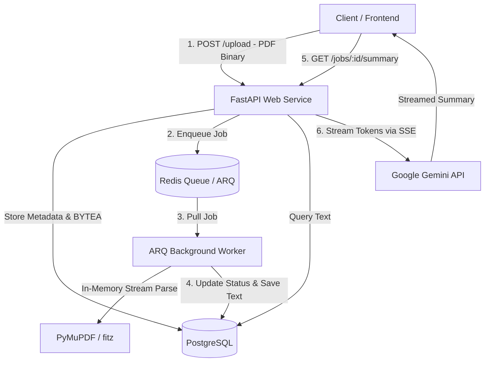

#  Async Document Summarizer

An asynchronous, distributed document processing system that extracts text from uploaded PDFs in background worker queues and streams AI-generated summaries in real time.

Built with **FastAPI**, **ARQ (Redis)**, **PostgreSQL (`asyncpg`)**, **PyMuPDF**, and the **Google Gemini API**.

---

## 🏗️ System Architecture

Traditional document processing in web APIs often blocks the event loop or causes request timeouts during heavy file parsing and LLM inference. This project decouples ingestion, text extraction, and summarization into a non-blocking, distributed architecture:



---

## ✨ Key Features & Architectural Decisions

* **Fully Asynchronous End-to-End:** Utilizes `asyncpg` connection pools and async route handlers to ensure zero event-loop blocking under high concurrent loads.
* **Decoupled Background Processing:** Offloads heavy PDF text extraction from the web server to a standalone ARQ worker service communicating via Redis.
* **In-Memory Stream Parsing:** Uses `PyMuPDF` (`fitz`) to parse binary streams directly from memory, eliminating dependency on shared/ephemeral local file systems.
* **Database BLOB Ingestion:** Stores PDF payloads temporarily in PostgreSQL (`BYTEA`), automatically clearing binary storage upon successful extraction to prevent database bloat.
* **Real-Time Token Streaming:** Delivers AI-generated summaries to the client in real time using Server-Sent Events (`text/event-stream`) via the Gemini API.
* **Fully Containerized:** Multi-container configuration managed via `docker-compose` isolating the web server, background worker, database, and Redis broker.

---

## 🛠️ Tech Stack

| Component | Technology |
| :--- | :--- |
| **Web Framework** | FastAPI (Python 3.11+) / Uvicorn |
| **Task Queue & Broker** | ARQ / Redis 7 |
| **Database & Driver** | PostgreSQL 15 / `asyncpg` |
| **PDF Extraction** | PyMuPDF (`fitz`) |
| **LLM Provider** | Google GenAI SDK (`gemini-3.6-flash`) |
| **Containerization** | Docker & Docker Compose |

---

## 📂 Project Structure

```text
.
├── main.py              # FastAPI application, routes, and DB/Redis lifespan pools
├── worker.py            # ARQ background task definitions for PDF parsing
├── static/
│   └── index.html       # Web UI for upload and live summary streaming
├── docker-compose.yml   # Multi-service container orchestration
├── Dockerfile           # Python application container image definition
├── requirements.txt     # Python runtime dependencies
├── .env                 # Environment variables (ignored by Git)
└── README.md
```

---

## 🚀 Getting Started

### Prerequisites

* [Docker Desktop](https://www.docker.com/products/docker-desktop/) installed and running.
* A [Google Gemini API Key](https://aistudio.google.com/).

### 1. Clone the Repository

```bash
git clone [https://github.com/YOUR_USERNAME/YOUR_REPO_NAME.git](https://github.com/YOUR_USERNAME/YOUR_REPO_NAME.git)
cd YOUR_REPO_NAME
```

### 2. Configure Environment Variables

Create a `.env` file in the root directory and add your API key:

```env
LLM_API_KEY=your_gemini_api_key_here
```

*(Note: Docker Compose automatically configures `DATABASE_URL` and `REDIS_HOST` for inter-container communication, so you do not need to add them here).*

### 3. Build and Run with Docker Compose

Launch all services (`db`, `redis`, `web`, and `worker`):

```bash
docker compose up --build
```

Access the web application by opening:
```text
http://localhost:8000
```

---

## 📡 API Reference

### 1. Upload Document
* **Endpoint:** `POST /upload`
* **Content-Type:** `multipart/form-data`
* **Payload:** `file: <PDF binary>`
* **Response:** `202 Accepted`
  ```json
  {
    "job_id": "0e9e90a2be4a49ec941b83ae8433c536"
  }
  ```

### 2. Check Job Status
* **Endpoint:** `GET /jobs/{job_id}`
* **Response:** `200 OK`
  ```json
  {
    "id": "0e9e90a2be4a49ec941b83ae8433c536",
    "document_name": "sample.pdf",
    "status": "completed",
    "extracted_text": "Extracted content...",
    "error_detail": null
  }
  ```
  *Possible `status` values: `pending`, `processing`, `completed`, `failed`.*

### 3. Stream Summary
* **Endpoint:** `GET /jobs/{job_id}/summary`
* **Response:** `200 OK` (Stream: `text/event-stream`)
  ```text
  data: {"text": "## Executive "}
  data: {"text": "Summary\n\nThis "}
  data: {"text": "document outlines..."}
  ```

---

## 🛡️ Concurrency & Error Handling

* **Deadlock Prevention:** Worker tasks manage database connections using natively asynchronous drivers without module-level locks, allowing ARQ to control task parallelism effectively.
* **Corrupt & Scanned PDF Handling:** PyMuPDF handles damaged byte streams gracefully; jobs without extractable text fail explicitly with clean error logging written back to the database.
* **Connection Lifecycle Management:** FastAPI's `lifespan` handler coordinates startup and shutdown sequences for database and Redis connection pools to prevent orphaned socket connections.
